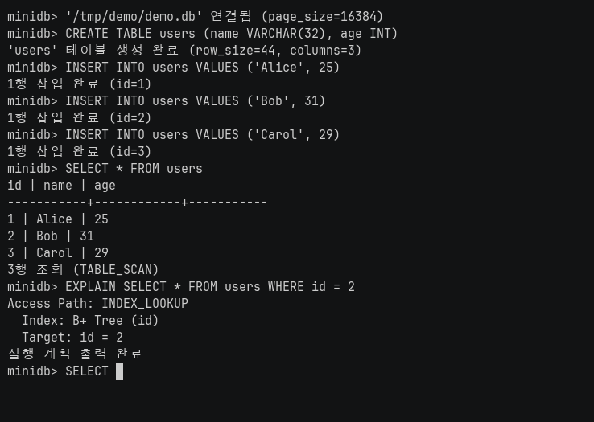

# 🗃️ lrn-sql — 디스크 기반 SQL 엔진

SQL 한 문장을 파싱해 실행 계획을 세우고, Slotted Page·B+Tree·Buffer Pool을 거쳐 디스크의 행을 직접 읽고 쓰는 C11 데이터베이스입니다. "DB가 안에서 무슨 일을 하는가"를 라이브러리 없이 끝까지 구현해 보려고 만들었습니다.



## 버전업된 모습

처음 만든 엔진은 10,000행 기준으로는 멀쩡해 보였습니다. **"시료가 작다"는 지적을 받고 규모를 1,000,000행으로 올리자 INSERT가 무너졌습니다.** 삽입 시간이 50k → 0.25초, 100k → 0.96초, 200k → 4.73초 — 행 수가 2배가 될 때마다 시간이 4배, O(N²)의 서명이었습니다.[^bench]

원인을 눈으로 못 찾아서 실행 중인 삽입 프로세스에 gdb를 붙여 스택을 샘플링했고, 그제서야 결함 2건이 잡혔습니다. 하나는 꼬리 페이지가 찰 때마다(약 90행마다) 삭제 슬롯 재활용을 위해 **DELETE가 한 번도 없었는데도 힙 체인 전체를 처음부터 다시 걷던** `find_heap_page`였습니다. 다른 하나는 서버 경로(`db.c`)는 문장 종료 시 lock을 풀지만 **REPL 경로(`main.c`)만 `lock_release_all()`을 빠뜨려** X-lock 엔트리가 lock 테이블에 영구 누적되던 것이었습니다. 스택 샘플 4회 중 4회가 그 해시 체인 탐색 위에 있었습니다. 두 번째 결함은 같은 autocommit 의미론을 두 경로에 따로 구현해 둔 탓이라, 성능 문제로 위장한 정확성 버그였다는 점이 뼈아팠습니다.

빈 슬롯 힌트(`heap_may_have_free_slots`)와 REPL의 Strict 2PL 준수로 고쳤습니다. 별도로 범위 질의가 `id` 조건에서도 힙을 전부 훑던 것을 B+Tree 리프 순회(`INDEX_RANGE`)로 바꿨습니다.

| 시나리오 (1M 행, median of 3) | 개선 전 | 개선 후 | 배수 |
|---|---:|---:|---:|
| INSERT (ops/sec) | 2,751 | **591,429** | ×215 |
| Range 질의 (ops/sec) | 2,943 | **3,218** | ×1.09 |
| Range — 인덱스 비활성 빌드 대비 | 73.9 | **3,218** | ×44 |
| Range 질의 (100k 행, ops/sec) | 630 | **3,292** | ×5.2 |
| `id >= 5000 LIMIT 1000` 페이지 로드 | 36 loads / 3.89 ms | **16 loads / ~2.0 ms** | — |

정직하게 덧붙이면, 개선 후 수치가 PostgreSQL(1M INSERT fsync=off 10,919 ops/sec)보다 높은 것은 성능 우위가 아닙니다. 이 엔진은 **WAL이 없어** dirty 페이지를 캐시 축출·종료 시에만 디스크로 내리므로 내구성 조건이 다릅니다. 같은 조건의 성능 비교로 읽으면 안 됩니다.[^bench]

## 구동모습

REPL에서 테이블을 만들고, 행을 넣고, 같은 질의가 `TABLE_SCAN`과 `INDEX_LOOKUP`으로 갈라지는 것을 `EXPLAIN`으로 확인하는 과정입니다.


## 메인 기술

- **Slotted Page 힙** — 페이지 안에 slot directory를 두고 삭제된 slot을 재사용합니다. 고정 `row_size` 직렬화. → [`src/storage/table.c`](src/storage/table.c)
- **B+Tree 점 조회와 범위 스캔** — 분할·삭제를 처리하고, 리프의 `next_leaf_page_id` 형제 포인터를 따라 오름차순 순회합니다. 리프 이동은 **다음 리프 rlatch를 먼저 잡고 현재를 해제**하는 leaf-chain latch coupling입니다. → [`src/storage/bptree.c`](src/storage/bptree.c)
- **규칙 기반 planner** — `id` 점 조건은 `INDEX_LOOKUP`, `id` 범위 조건(`BETWEEN`, `>=`, `<`)은 `INDEX_RANGE`, 그 밖은 `TABLE_SCAN`으로 접근 경로를 고릅니다. 비용 기반이 아닌 규칙 기반입니다. → [`src/sql/planner.c`](src/sql/planner.c)
- **pin·dirty·LRU Buffer Pool** — 256개 frame을 관리하며 pin된 페이지는 교체 대상에서 제외합니다. → [`src/storage/pager.c`](src/storage/pager.c)
- **Strict 2PL 행·범위 lock** — S/X lock 호환성과 범위 lock으로 phantom insert를 막고, 문장 종료 시 전부 해제하는 autocommit 경로입니다. → [`src/server/lock_table.c`](src/server/lock_table.c)
- **재현용 컴파일 가드** — `-DMINIDB_DISABLE_INDEX_RANGE`, `-DMINIDB_DISABLE_FREE_HINT`로 개선 전 동작을 그대로 빌드해 전/후를 같은 바이너리 계열에서 비교합니다.

## 계획

- WAL을 넣어 갑작스러운 중단에서의 crash recovery를 검증한다. 지금은 정상 종료 후 재열기만 보장한다.
- secondary index를 추가하면 planner를 규칙 기반에서 **선택도 기반 비용 모델**로 바꾼다.
- 여러 문장을 묶는 명시적 트랜잭션(`BEGIN`/`COMMIT`)을 지원하면 지금의 문장 단위 Strict 2PL을 트랜잭션 단위로 확장한다.
- 1M을 넘는 규모에서 DB 파일이 페이지 캐시를 벗어나면(현재 1M ≈ 52MB) 디스크가 실제 병목인 구간을 다시 측정한다.

## 링크

- [SQL 엔진 구현 Wiki](https://docs.woonyong.com/wiki/lrn-sql/)
- [설계 문서 목차](docs/README.md)
- [PostgreSQL 대조 실험 전문](docs/benchmark-postgres.md)
- [팀 원본 저장소 (Jungle-12-303/wk08_1)](https://github.com/Jungle-12-303/wk08_1)
- [CI 실행 기록](https://github.com/woonyong-choi/lrn-sql/actions)

## 담당

**크래프톤 정글 팀 과제(원본: [Jungle-12-303/wk08_1](https://github.com/Jungle-12-303/wk08_1))에서 시작했고, 종료 후 개인 저장소에서 계속 수정·학습·확장하고 있습니다.**

| 항목 | 내용 |
|---|---|
| 원본 팀 저장소 | [Jungle-12-303/wk08_1](https://github.com/Jungle-12-303/wk08_1) |
| 팀 과제 기간 | 2026-04-16 ~ 2026-05-08 (커밋 `40327ef` ~ `e5d7238`). 다른 팀원의 마지막 커밋은 2026-04-22 |
| 팀 구성 | 4인 (최우녕, 정범진, 이호준, 최현진) — 저자별 커밋 수는 `git shortlog -sne`로 확인 |
| **본인 담당** | **저장소 전반의 엔진 코드(parser·planner·executor·pager·bptree·table·lock_table)를 개인 주도로 대부분 직접 구현** |

팀 코드 전체를 개인 구현으로 주장하지 않습니다. 팀 기간의 기여 구분은 원본 저장소의 커밋 저자와 파일별 diff로 확인합니다.

### 개인 확장 (팀 과제 종료 후)

**커밋 범위: [`369fb58`](https://github.com/woonyong-choi/lrn-sql/commit/369fb58) (2026-08-01) ~ [`bfc27a9`](https://github.com/woonyong-choi/lrn-sql/commit/bfc27a9) (2026-09-11), 11개 커밋.** `git log --author` 기준입니다.[^authors]

| 무엇이 달라졌나 | 커밋 | 파일 |
|---|---|---|
| B+Tree 인덱스 **범위 스캔**(`INDEX_RANGE`) 추가 — `BETWEEN`·부등호 파싱, 접근 경로, 리프 순회 | `c1049b0` | `bptree.c`, `parser.c`, `planner.c`, `executor.c` |
| 1M 행 INSERT의 **O(N²) 결함 2건** 수정 — 힙 재탐색 힌트, REPL lock 해제 누락 | `993d4d8` | `table.c`, `pager.c`, `main.c`, `executor.c` |
| **sanitizer 선택 빌드**(ASAN/UBSAN)와 224개 테스트를 묶는 CI 게이트 도입 | `7b7c43f`, `3651a8d` | `Makefile`, `.github/workflows/ci.yml` |
| 저장소 정리 — 빌드 산출물·Python 캐시·작업용 스테이징 폴더 제거 | `b169446`, `eeaa0ab` | `.gitignore` 외 |
| 문서 — 저장 구조 선택 근거, 실행 방법, 출처·기여 경계 명시 | `369fb58`, `bd0d068`, `913de5c`, `bfc27a9` | `README.md`, `docs/` |

팀 과제 종료 시점(`e5d7238`) 대비 엔진 코드 순증은 `src/` 기준 +388/-2행입니다(`git diff --stat e5d7238 HEAD -- src/`).

## 구동방법

GCC, Make, pthread가 필요합니다. Linux는 저장소의 Dev Container 설정을 쓸 수 있습니다.

```sh
git clone https://github.com/woonyong-choi/lrn-sql.git
cd lrn-sql
make
./build/minidb demo.db
```

새 DB의 REPL에서 다음을 한 줄씩 입력합니다.

```sql
CREATE TABLE users (name VARCHAR(32), age INT)
INSERT INTO users VALUES ('Alice', 25)
SELECT * FROM users
EXPLAIN SELECT * FROM users WHERE id = 1
SELECT * FROM users WHERE id = 1
```

`1 | Alice | 25`가 나오고 `INDEX_LOOKUP` 계획을 확인할 수 있습니다. `.stats`는 페이지·트리 통계, `.debug`는 쿼리별 페이지 접근, `.btree`는 인덱스 구조를 보여 줍니다. `.exit` 또는 Ctrl-D로 종료하면 dirty 페이지를 기록합니다.

기본 빌드는 ASAN·UBSAN을 켭니다. macOS에서 sanitizer 초기화 문제가 있으면 sanitizer를 뺀 빌드를 씁니다(해당 검사를 대신하지는 않습니다).

```sh
make BUILD_DIR=build-nosan SANITIZE= all
./build-nosan/minidb demo.db
```

설계 문서는 [`docs/README.md`](docs/README.md)를 참조합니다.

## 스펙

| 구분 | 내용 |
|---|---|
| 언어 | C11 (`-Wall -Wextra -Werror`) |
| 빌드 | GNU Make, GCC |
| 런타임 의존성 | POSIX pthread만 사용. **외부 DB·파서·인덱스 라이브러리 없음** |
| 진단 도구 | AddressSanitizer, UndefinedBehaviorSanitizer, gdb(스택 샘플링) |
| 서버 경로 | 자체 HTTP 처리(keep-alive, 요청 읽기 타임아웃) |
| 벤치마크 하니스 | Python 3 + psycopg2 (`bench/`), 대조군 PostgreSQL 16.13 |

## 검증

[](https://github.com/woonyong-choi/lrn-sql/actions/workflows/ci.yml)

`make test-all`은 저장 구조·SQL·동시 요청을 검사합니다. **224개 전부 통과**합니다(2026-09-22 로컬 재실행).[^tests]

| 스위트 | 통과 | 대상 |
|---|---:|---|
| MiniDB Test Suite | 76/76 | 페이지·힙·B+Tree·재열기 |
| Step 0 — `db_execute` | 24/24 | 문장 실행 진입점 |
| Step 1 — SQL Extension | 72/72 | 파싱·계획·조건·정렬·집계 |
| Step 2 — Concurrency | 52/52 | S/X lock 호환성, 범위 lock, 동시 INSERT, HTTP 경로 |
| **합계** | **224/224** | |

```sh
make test-all                                         # 224개 테스트 (CI와 동일)
python3 bench/bench_minidb_param.py --rows 1000000    # 1M 행 벤치마크 재현
python3 bench/bench_pg_param.py --rows 1000000 --reps-insert 1   # PostgreSQL 대조군
```

CI는 GitHub Actions에서 `ASAN_OPTIONS=detect_leaks=1`, `UBSAN_OPTIONS=halt_on_error=1`로 `make test-all`을 실행합니다.

### 현재 범위

단일 테이블과 자동 생성 `id` 인덱스를 중심으로 CREATE·INSERT·SELECT·UPDATE·DELETE·DROP과 일부 조건·정렬·집계를 지원합니다. secondary index, 비용 기반 optimizer, 여러 문장을 묶는 트랜잭션, WAL crash recovery는 **없습니다.** 정상 종료 후 재열기는 보장하지만 갑작스러운 중단에서의 복구는 범위 밖입니다.

## 참고자료

- [PostgreSQL 대조 실험 전문](docs/benchmark-postgres.md) — 측정 조건·결함 진단·정직한 평가
- [팀 원본 저장소 Jungle-12-303/wk08_1](https://github.com/Jungle-12-303/wk08_1)
- Database Internals (Alex Petrov) — Slotted Page·B+Tree 구조
- [PostgreSQL 16 문서](https://www.postgresql.org/docs/16/) — 대조군 설정(`synchronous_commit`, `fsync`)

[^bench]: 측정 조건·결함 진단·재현 명령은 [`docs/benchmark-postgres.md`](docs/benchmark-postgres.md) 9절("규모를 키우니 다른 곳이 무너졌다"). 1M 행 median of 3.
[^authors]: `git log --author='woonyong' --since=2026-06-01 --reverse --format='%h %ad %s' --date=short`
[^tests]: `make BUILD_DIR=build-nosan SANITIZE= test-all` 출력의 스위트별 합계.
